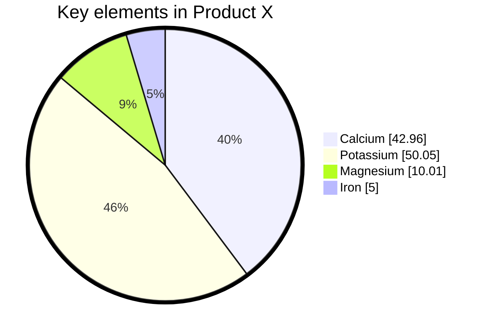
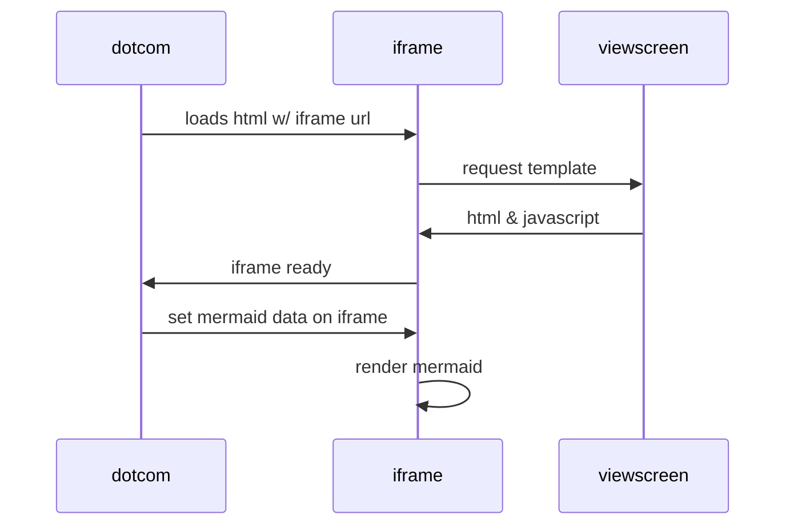
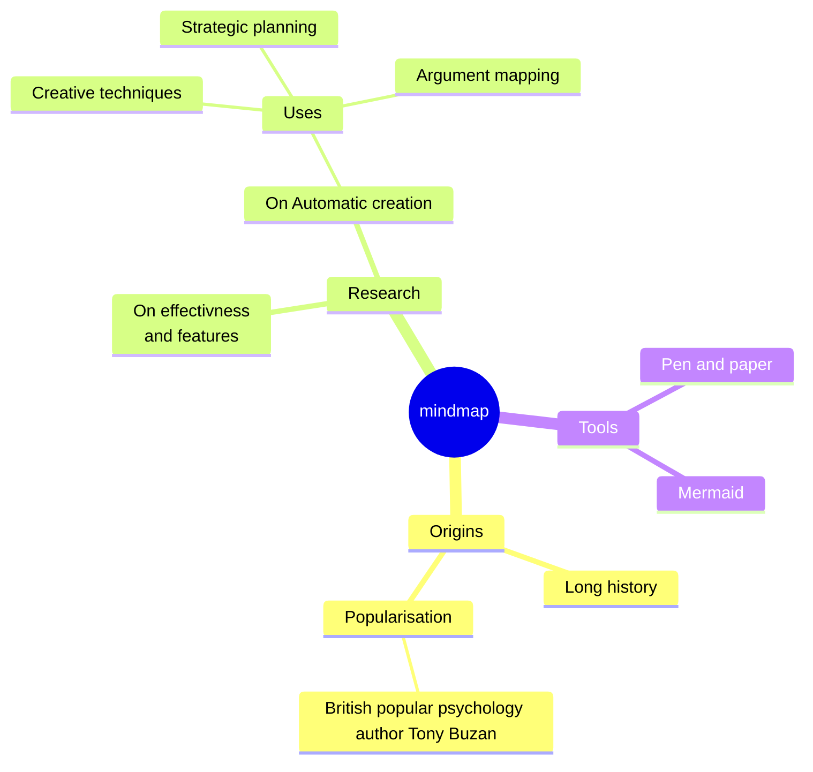
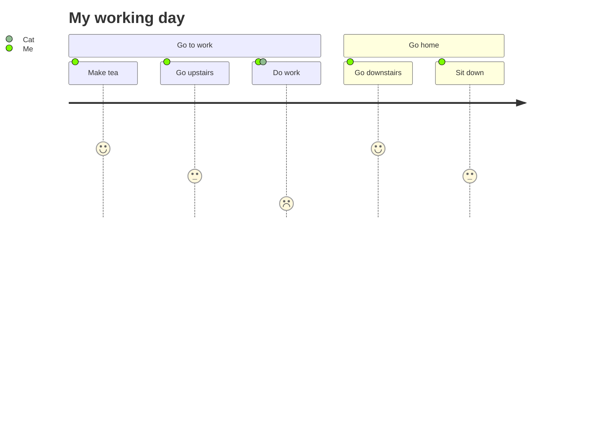
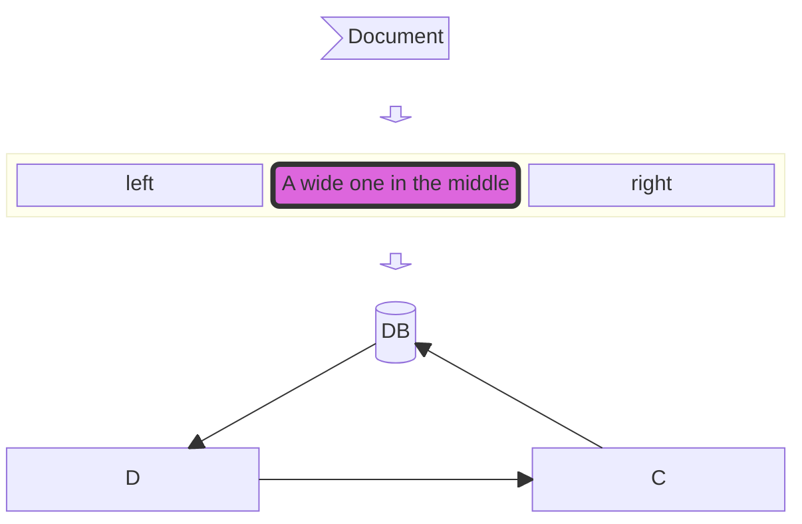
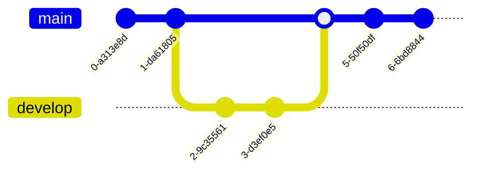
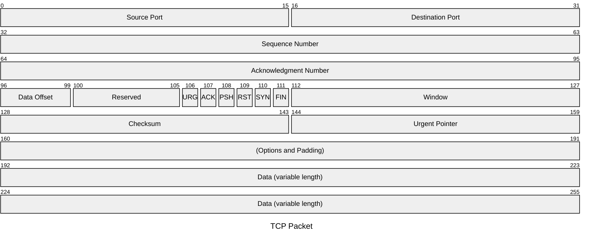
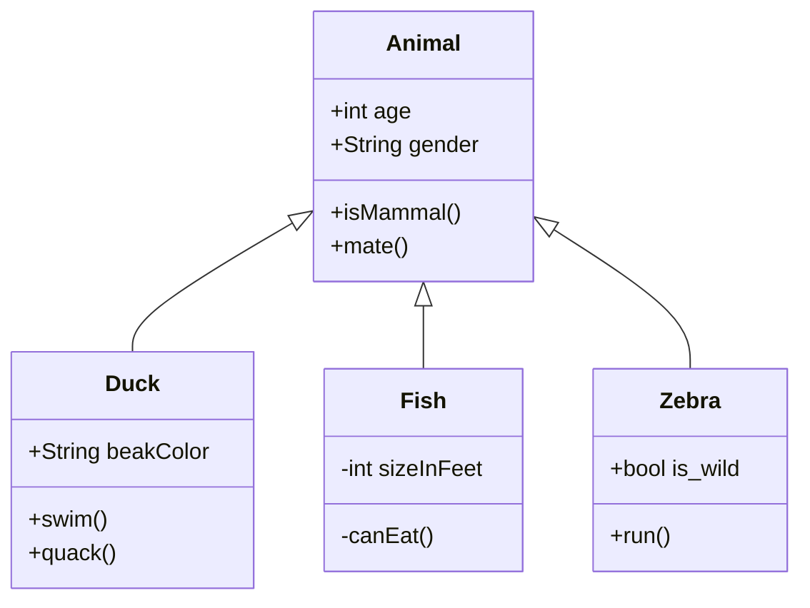
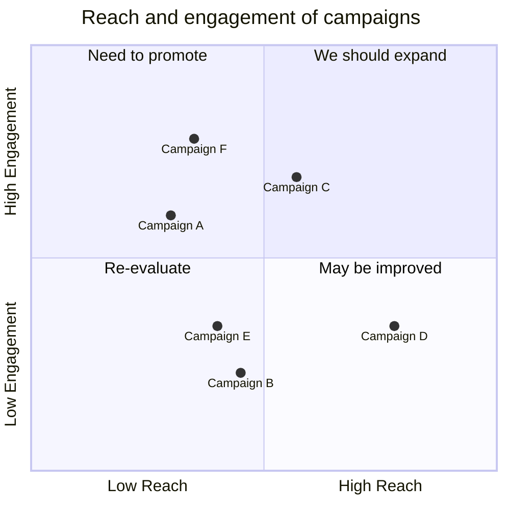
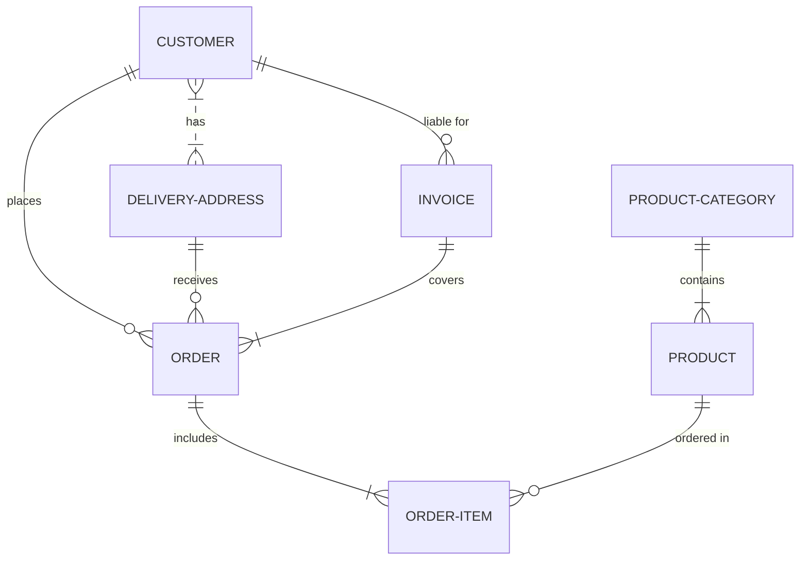

<h1 align="center">Markdown Cheatsheet</h1>

# Type here...
Type here...

## Type here...

Type here...

### Type here...
Type here...
-
# Tables
### 2 Column Table
| Month    | Savings |
| -------- | ------- |
| January  | $250    |
| February | $80     |
| March    | $420    |

### 3 Column Table
| Item              | In Stock | Price |
| :---------------- | :------: | ----: |
| Python Hat        |   True   | 23.99 |
| SQL Hat           |   True   | 23.99 |
| Codecademy Tee    |  False   | 19.99 |
| Codecademy Hoodie |  False   | 42.99 |

### 3 Column Table with Images
|Content    |Example1    |Example2    |
| --- | --- | --- |
|  |  | |
|  |  |  |
|  |  |  |  

### Table Alignment
- :-- means the column is left aligned.
- --: means the column is right aligned.
- :-: means the column is center aligned.
-
# How to add graphs -> Mermaid
The best way to add graphs in Markdown is with [Mermaid](https://mermaid.js.org/). It is a JavaScript-based diagramming and charting tool that integrates seamlessly with Markdown. It allows users to create visually appealing diagrams, such as flowcharts, sequence diagrams, Gantt charts, and more, directly within Markdown documents using a simple and intuitive syntax. By embedding Mermaid code blocks in Markdown, you can dynamically generate diagrams that are easy to maintain and share, making it a popular choice for documentation and technical writing.

<p>You can make many types of graphs, from diagrams to flow chart.</p>

### Pie Chart

### Bar Chart
```mermaid
    xychart-beta
    title "Sales Revenue"
    x-axis [jan, feb, mar, apr, may, jun, jul, aug, sep, oct, nov, dec]
    y-axis "Revenue (in $)" 4000 --> 11000
    bar [5000, 6000, 7500, 8200, 9500, 10500, 11000, 10200, 9200, 8500, 7000, 6000]
    line [5000, 6000, 7500, 8200, 9500, 10500, 11000, 10200, 9200, 8500, 7000, 6000]
 ```   
### Diagram
```mermaid
  graph TD;
      A-->B;
      A-->C;
      B-->D;
      C-->D;
```

### Mindmap

### User Journey Chart

### Block Chart

### Git Hierarchy Graph

### Packet Graph

### Class Diagram

### Quadrant Chart

### ER Chart

